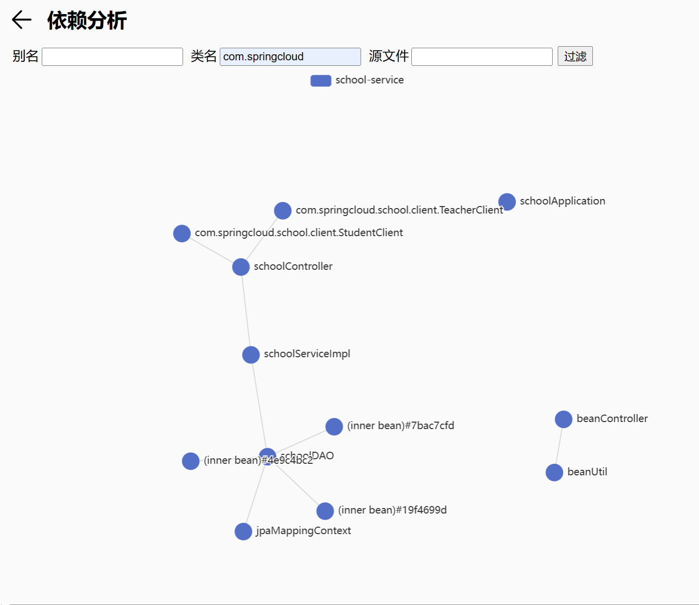

简介
--


一款**可视化的分析工具**，给微服务模块拆分提供**可量化的拆分依据**，以及**评估**拆分前后的**性能指标**变化。

基于`Qwik` \+ `Echarts` 打造，专门用于Spring模块可视化分析的工具。目前该工具使用 `tauri` 打包成Web App，支持 `Windows` `Mac` `Linux` 等平台（暂不支持win7、xp），可以根据实际需求下载安装后进行使用。

Spring依赖分析
==========

基于代码扫描的**静态分析**，只需要把 `Spring IoC` 容器保存的 `Bean` 信息导出来即可，而正好 `Spring Boot Actuator` 模块刚好提供 `/beans` 接口用于导出Bean信息，Bean信息结构大概如下：

```json
{
    "contexts": {
        "school-service": {
            "beans": {
                "spring.jpa-org.springframework.boot.autoconfigure.orm.jpa.JpaProperties": {
                    "aliases": [],
                    "scope": "singleton",
                    "type": "org.springframework.boot.autoconfigure.orm.jpa.JpaProperties",
                    "resource": null,
                    "dependencies": []
                }
            }
        }
    }
}
```

对于没有使用 `Spring Boot` 的老旧项目，以下就是参考 `Actuator` 源码实现的替代实现：

```java
package com.springcloud.school;

import com.fasterxml.jackson.annotation.JsonProperty;
import org.springframework.beans.factory.annotation.Autowired;
import org.springframework.beans.factory.config.BeanDefinition;
import org.springframework.beans.factory.config.ConfigurableBeanFactory;
import org.springframework.beans.factory.config.ConfigurableListableBeanFactory;
import org.springframework.context.ApplicationContext;
import org.springframework.context.ConfigurableApplicationContext;
import org.springframework.stereotype.Component;
import org.springframework.util.StringUtils;
import java.util.HashMap;
import java.util.Map;

@Component()
public class CustomBeansEndpoint {
@Autowired
ConfigurableApplicationContext context;

public ApplicationBeans beans() {
    Map contexts = new HashMap<>();

    for(ConfigurableApplicationContext context = this.context; context != null; context = getConfigurableParent(context)) {
        contexts.put(context.getId(), ContextBeans.describing(context));
    }

    return new ApplicationBeans(contexts);
}

static ConfigurableApplicationContext getConfigurableParent(ConfigurableApplicationContext context) {
    ApplicationContext parent = context.getParent();
    return parent instanceof ConfigurableApplicationContext ? (ConfigurableApplicationContext)parent : null;
}

public static class BeanDescriptor {
    @JsonProperty("aliases")
    String[] aliases;
    @JsonProperty("scope")
    String scope;
    @JsonProperty("type")
    Class type;
    @JsonProperty("resource")
    String resource;
    @JsonProperty("dependencies")
    String[] dependencies;

    private BeanDescriptor(String[] aliases, String scope, Class type, String resource, String[] dependencies) {
        this.aliases = aliases;
        this.scope = StringUtils.hasText(scope) ? scope : "singleton";
        this.type = type;
        this.resource = resource;
        this.dependencies = dependencies;
    }
}

public static class ContextBeans {
    @JsonProperty("beans")
    Map beans;
    @JsonProperty("parentId")
    String parentId;

    ContextBeans(Map beans, String parentId) {
        this.beans = beans;
        this.parentId = parentId;
    }

    static ContextBeans describing(ConfigurableApplicationContext context) {
        if (context == null) {
            return null;
        } else {
            ConfigurableApplicationContext parent = getConfigurableParent(context);
            return new ContextBeans(describeBeans(context.getBeanFactory()), parent != null ? parent.getId() : null);
        }
    }

    static Map describeBeans(ConfigurableListableBeanFactory beanFactory) {
        Map beans = new HashMap<>();
        String[] var2 = beanFactory.getBeanDefinitionNames();
        int var3 = var2.length;

        for(int var4 = 0; var4 < var3; ++var4) {
            String beanName = var2[var4];
            BeanDefinition definition = beanFactory.getBeanDefinition(beanName);
            if (isBeanEligible(beanName, definition, beanFactory)) {
                beans.put(beanName, describeBean(beanName, definition, beanFactory));
            }
        }

        return beans;
    }

    static BeanDescriptor describeBean(String name, BeanDefinition definition, ConfigurableListableBeanFactory factory) {
        return new BeanDescriptor(factory.getAliases(name), definition.getScope(), factory.getType(name), definition.getResourceDescription(), factory.getDependenciesForBean(name));
    }

    static boolean isBeanEligible(String beanName, BeanDefinition bd, ConfigurableBeanFactory bf) {
        return bd.getRole() != 2 && (!bd.isLazyInit() || bf.containsSingleton(beanName));
    }
}

public static class ApplicationBeans {
    @JsonProperty("contexts")
    Map contexts;

    ApplicationBeans(Map contexts) {
        this.contexts = contexts;
    }

    public Map getContexts() {
        return this.contexts;
    }
}

}
```

新建 `CustomBeansEndpoint.java` 文件，然后把以上Java代码复制粘贴进文件中，最后新增 `BeanController`

```java
package com.springcloud.school.controller;

import com.springcloud.school.CustomBeansEndpoint;
import org.springframework.beans.factory.annotation.Autowired;
import org.springframework.web.bind.annotation.GetMapping;
import org.springframework.web.bind.annotation.RequestMapping;
import org.springframework.web.bind.annotation.RestController;

@RestController@RequestMapping("/beans")
public class BeanController {
    @Autowired()
    CustomBeansEndpoint beansEndpoint;
    @GetMapping("/")
    public Object beans() {
        return beansEndpoint.beans();
    }
}
```

把代码修改完再运行起来，在浏览器打开 `https://localhost:8080/beans` 就会返回JSON内容，然后复制JSON字符串保存到 `beans.json` 文件。

> 切记：为了稳妥起见，建议**只在开发环境运行**，不要提交或部署到生产/预生产环境，以免造成不可挽回的损失。

### 可视化分析

有了JSON数据，就可以进行可视化分析，点击首页中间的 `开始` 按钮，选中上一步导出的 `beans.json` 文件，然后就自动跳转到 `依赖分析` 页面


看到满屏密密麻麻的文字先别慌，因为actuator导出的bean很多是spring框架自带的，可以在左上方 **类名** 右侧的输入框，输入你的 `package` 包名，然后点击最右侧的 `过滤` 按钮就可以把多余的bean过滤掉。比如输入 `com.springclcoud` 再点击 `过滤` 按钮：



现在可以看到不相干的bean已经被过滤掉，还可以**通过鼠标滚轮来缩放画面**。

如果你的项目包含的bean数量非常多，可以**追加子包名进行过滤**，比如说 `com.springcloud.school` ，

随着包名的不断变长，原来连成一片的点集，会分割成几个相互独立的小点集，这些**小点集就相当于划分好的微服务模块**。

以上基于代码的静态分析，实际上就是**基于包名进行微服务模块划分**，有一个非常重要的前提就是先前的项目结构需要非常合理，而实际情况却是大部分项目结构非常混乱，因此以包名作为微服务模块划分的依据并不合理。

但是有这么一个工具，可以**非常直观了解现有的项目结构**，**评估微服务模块拆分之前的代码质量**还是很有帮助的，尤其是当你刚接手一个完全陌生的项目，spring 依赖分析是快速了解项目结构的有力工具。

调用链分析
-----

前面说到的静态分析虽然非常直观，但明显缺乏量化指标。

比方说 `A模块` 同时依赖于 `B模块` 和 `C模块` ，`A模块` 每分钟会调用 `B模块` 上百次，但只会调用 `C模块` 一次，这种情况静态分析是无法进行有效的模块划分，因此我们需要在运行时收集数据才能正确划分。

简单来说，就是通过 `Spring AOP` 给特定包下的所有方法织入一段代码逻辑，用于**统计各模块之间相互调用的次数以及耗时**，具体做法就是新建 `Profile.java` 文件，然后写入以下代码：

```java
package com.springcloud.school;

import org.aspectj.lang.ProceedingJoinPoint;
import org.aspectj.lang.annotation.Around;
import org.aspectj.lang.annotation.Aspect;
import org.springframework.stereotype.Component;
import java.util.Stack;

@Aspect
@Component
public class Profile {
    // ThreadLocal用于解决线程安全问题，每个线程的方法栈是独占的，因此可以避免冲突
    ThreadLocal> methodStack = new ThreadLocal<>() {
        @Override
        protected Stack initialValue() {
            return new Stack<>();
        }
    };

    @Around("execution(* com.springcloud.school..*.*(..)) && !bean(profile)")
    public void count(ProceedingJoinPoint pj) {
        Stack stack = methodStack.get();
        String peak = stack.empty() ? "root" : stack.peek();
        String className = pj.getSignature().getDeclaringTypeName();
        stack.push(className);
        long start = System.currentTimeMillis();
        try {
            pj.proceed();
        } catch (Throwable e) {
            throw new RuntimeException(e);
        } finally {
            long end = System.currentTimeMillis();
            long gap = end - start;
            // 这里选择直接把调用记录输出到日志，有条件的可以选发送到消息队列进一步处理
            System.out.println("trace: " + peak + " -> " + className + " : " + gap);
            stack.pop();
        }
    }
}
```

解释一下统计调用次数以及耗时的思路：

首先初始化一个栈，然后每当方法被调用之前，就把方法名称入栈，方法调用结束后就出栈，然后把结果输出到日志文件或者消息队列，这里为了方便演示直接用 System.out.println。

这里记得把 `@Around("execution(* com.springcloud.school..*.*(..)) && !bean(profile)")` 的 `com.springcloud.school` 换成你项目所用的包名，至于最右边的 `!bean(profile)` 就是把 `Profile` 类给排除，因为我把 Profile.java 也保存到 `com.springcloud.school` 下。

接着把修改后的代码放到环境上运行，然后跑一下全量接口测试，测试尽可能覆盖所有的业务模块，根据实际情况调整收集时长，等积累足够多的调用记录，就可以进行下一步：处理收集结果。

> 切记：为了安全起见，建议**只在开发环境运行**，不要提交或部署到生产/预生产环境，以免料

这里只说输出到日志的处理方法，首先根据前缀 `trace:` 过滤得到相关的调用记录，然后把每行的箭头 `->` 和 冒号 `:` 替换成逗号 `,` ，然后保存到 `trace.csv` 文件，最终的文件结构如下：

```Plain Text
com.springcloud.school.controller.BeanController,com.springcloud.school.CustomBeansEndpoint,10
root,com.springcloud.school.controller.BeanController,39
com.springcloud.school.service.BaseServiceImpl,org.springframework.data.repository.PagingAndSortingRepository,323
```

第一列是调用方，第二列是被调用方，第三列是耗时，三者通过逗号分割，只要符合这个规则的csv文件就可以被用于可视化分析。

> 因此微服务模块划分的粒度最小也是类，很少到方法级别，所以**调用方**和**被调用方**其实是**方法所属的类**，而不是方法名。

### 可视化分析

我们重新打开之前的 [Spring Module Analyzer](https://github.com/zaoying/spring-module-analyzer/releases/latest) 工具，然后点击右边 `链路分析` 按钮，再点击下方 `开始` 按钮，选择之前保存 `trace.csv` 文件，然后点击 `确定` 按钮


进入 `链路分析` 页面，左上角 `起点` 和 `终点` 两个输入框，可以根据包名进行过滤，和之前的依赖分析大同小异


和前面不同的是多了 `求值` 下拉框，以及 `范围` 输入框。

“求值” 有五个选项：`计数`、`平均值`、`求和`、`最小值` 和 `最大值` 。以下是各选项适用的场景：

*   `计数` ：就是累计两个模块之间的调用次数，可以配合调高范围的下界，来过滤掉某些出现次数很少的调用记录，从而分离出更多的点集，自动完成模块划分；也可以调低范围的上限，过滤某些因为循环或递归调用频繁出现的记录；
*   `平均值`：就是用总的耗时除以总的调用次数，得出每次调用方法的平均耗时，可用于评估微服务模块划分前的实际延迟，一般平均耗时低于100毫秒的模块不宜拆分，因为微服务模块之间RESTful接口调用基本上都大于100毫秒，把原本平均耗时大于100毫秒的模块拆分到不同微服务并不会显著增加系统延迟；
*   `求和` ：两个模块之间相互调用所需要的总耗时
*   `最小值` ：两个模块之间相互调用耗时的最小值
*   `最大值` ：两个模块之间相互调用耗时的最大值

总结
--

基于Spring依赖的可视化分析，可以快速大概掌握项目结构的基本情况，同时也能直观地感受代码架构是否符合 `低耦合高内聚` 的要求，对后续的代码重构优化也有一定的指导作用；在对项目结构有基本的了解后，就可以结合调用链分析，在微服务模块拆分之前，对系统整体的性能指标有确切的数据，也能通过和图表的交互，大致预估微服务模块拆分后的项目结构以及系统性能的变化。